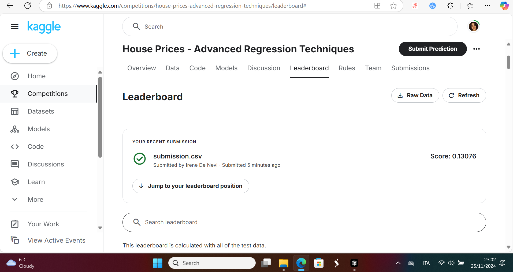

# 🏠 House Prices: Advanced Regression Techniques

**Author**: Irene De Nevi  
**Kaggle Profile**: [View Profile](https://www.kaggle.com/)  
**Competition**: [House Prices - Advanced Regression Techniques](https://www.kaggle.com/competitions/house-prices-advanced-regression-techniques)

---

## 📝 Project Overview

This repository contains my submission for the **Kaggle Supervised Learning Competition**, completed as part of a machine learning course assignment. The challenge involves developing a supervised regression model to predict house sale prices using a mix of numerical and categorical variables.

The goal of the assignment is to demonstrate proficiency in:
- Model building
- Feature engineering
- Hyperparameter tuning
- Evaluation using real-world data

---

## 📂 Repository Structure
```yaml
|-- DeNevi_Irene_report.md # Project report (Markdown version)
|-- Assessment_DeNeviIrene.ipynb # Jupyter notebook for model development
|-- submission.csv # Final predictions submitted to Kaggle
|-- submission.png # Screenshot of Kaggle submission
|-- Leaderboard.png # Screenshot showing leaderboard rank
|-- LICENSE # Apache 2.0 License
```

---

## 🔍 Competition Details

- **Competition Name**: House Prices - Advanced Regression Techniques  
- **Task Type**: Supervised regression  
- **Target Variable**: `SalePrice`  
- **Dataset**: 1,460 training samples, 79 features  
- **Goal**: Predict final house sale prices using historical housing data.

---

## ✅ Model Development Summary

### 🔧 Steps Taken:
1. **Data Preprocessing**
   - Imputation of missing values using median, mode, or 'None' for categorical columns
   - Outlier detection and removal based on `GrLivArea` and `SalePrice`
   - Log-transform of skewed numeric features to normalize distribution

2. **Feature Engineering**
   - Combined features to create new ones (e.g., `TotalSF`)
   - Converted categorical features using one-hot encoding
   - Standardized numerical features

3. **Model Selection**
   - Trained multiple models: Linear Regression, Lasso, Ridge, XGBoost
   - Final model: **Ensemble of Lasso and XGBoost** for better generalization

4. **Hyperparameter Tuning**
   - Performed cross-validation with `GridSearchCV` for Lasso
   - Tuned XGBoost using manual iterative search

5. **Evaluation**
   - Metric: **Root Mean Squared Log Error (RMSLE)** as used by Kaggle
   - Final predictions exported as `submission.csv`

---

## 🧪 Performance

- ✅ **Submission Screenshot**:  
  

- 🏆 **Leaderboard Position**:  
  

---

## 📄 Report

A complete explanation of the methodology, decisions, and results can be found in:  
📄 `DeNevi_Irene_report.md` *(submitted as PDF in final assignment)*

---

## 🚀 Reproducing the Submission

To reproduce the results and generate the submission file:

1. **Clone the repository**
   ```bash
   git clone https://github.com/IreneDeNevi/House-Prices-Advanced-Regression-Techniques.git
   cd House-Prices-Advanced-Regression-Techniques
Open the notebook
Run main.ipynb in Jupyter or VSCode (ensure all necessary packages are installed).

Generate submission.csv
The final cell exports the predictions used for the Kaggle submission.

🔧 A requirements.txt file is not provided, install the following key libraries manually:

numpy, pandas, scikit-learn, xgboost, matplotlib, seaborn

